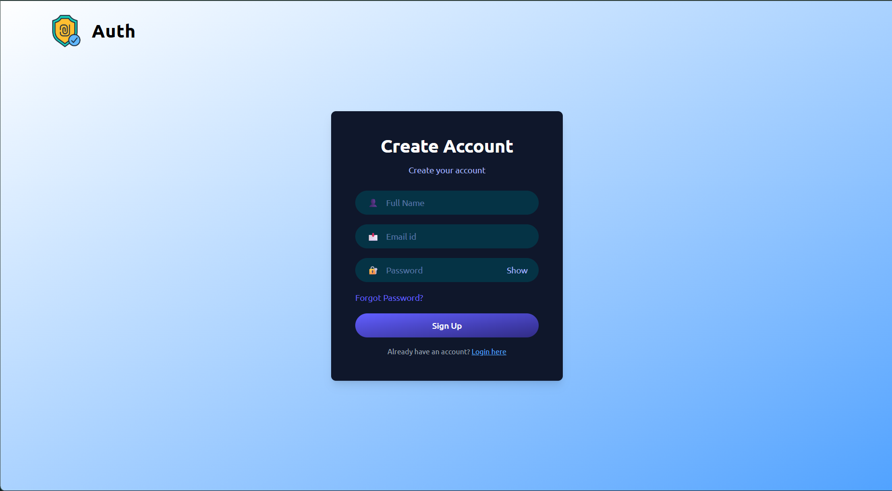
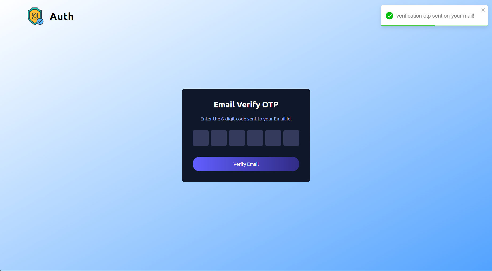
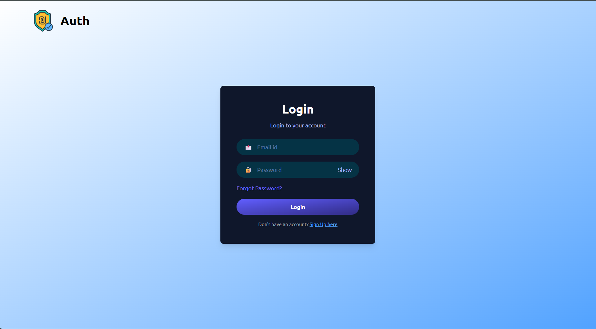
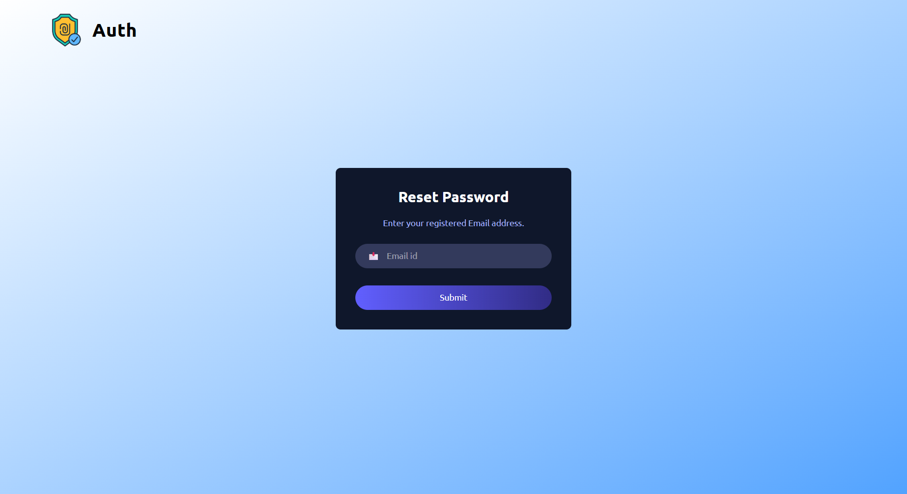

🔐 auth_project_MERN
A secure, full-stack authentication system built with the MERN stack (MongoDB, Express, React, Node.js). Features JWT-based sessions, OTP-driven email verification, and a full forgot/reset password flow with custom-designed HTML email templates — with separate `client` and `server` codebases.


---
📸 Screenshots
<!-- Add screenshots or a GIF walkthrough here. Suggested shots: registration form → OTP email → verification success → login → forgot password → reset email → reset success. -->
Registration	Email Verification (OTP)
	

Login	Forgot / Reset Password
	
---
✨ Features
User Registration — sign up with name, email, and password
Login / Logout — secure session handling with JWT
JWT Authentication — stateless, signed token-based auth across protected requests
Password Hashing — bcrypt used for both user passwords and OTP codes, never stored in plaintext
Input Validation — server-side validation on all incoming request data
CORS Configured — secured cross-origin access between the separate client and server
Email Verification via OTP — 6-digit code sent on registration to confirm the user's email
Forgot / Reset Password via OTP — request a reset code by email, verify it, then set a new password
Custom HTML Email Templates — hand-built, responsive, email-client-safe templates for verification and password reset emails
REST API — clean, resource-based API design powering the frontend
🛣️ Roadmap / Coming Soon
[ ] Role-based access control (RBAC)
[ ] Protected route middleware for role-restricted resources
[ ] API documentation
---
🛠️ Tech Stack
Layer	Technology
Frontend	React
Backend	Node.js, Express.js
Database	MongoDB with Mongoose ODM
Auth	JSON Web Tokens (JWT)
Password Hashing	bcrypt
Email Delivery	Nodemailer
---
⚙️ Getting Started
Prerequisites
Node.js (v18 or higher recommended)
MongoDB (local instance or MongoDB Atlas)
An SMTP provider or transactional email service (e.g. Gmail App Password, SendGrid, Mailtrap for testing)
Installation
Clone the repository
```bash
   git clone https://github.com/Kumar-Shivam01/auth_project_MERN.git
   cd auth_project_MERN
   ```
Install dependencies (for both client and server)
```bash
   cd server
   npm install

   cd ../client
   npm install
   ```
Configure environment variables
Create a `.env` file inside the `server` directory (see `.env.example`):
```env
   # MongoDB
   MONGO_URI=your_mongodb_atlas_connection_string
   LOCAL_CONN_STR=your_local_mongodb_connection_string
   DB_USER=your_db_username
   DB_PASSWORD=your_db_password

   # Server
   PORT=3001
   NODE_ENV=development

   # JWT
   SECRET_STR=your_jwt_secret_key
   JWT_EXPIRE=7d

   # Email (SMTP)
   EMAIL_HOST=your_smtp_host
   EMAIL_PORT=your_smtp_port
   EMAIL_USER=your_smtp_username
   EMAIL_PASS=your_smtp_password
   ```
> ⚠️ Never commit your actual `.env` file. Keep only `.env.example` (with placeholder values) in version control, and make sure `.env` is listed in `.gitignore`.
Run the backend
```bash
   cd server
   npm run dev
   ```
Run the frontend
```bash
   cd client
   npm start
   ```
The backend will run on `http://localhost:3001` (or your configured `PORT`), and the React frontend on its default port (typically `http://localhost:3000`).
---
🔒 Security Notes
OTP codes and passwords are hashed with bcrypt before being stored — never saved in plaintext
Password reset follows a two-step flow (verify OTP → get reset token → reset password) so a leaked OTP alone can't be used to change a password
Input validation is enforced on the server side for all auth-related requests
CORS is explicitly configured to control which origins can access the API
---
🙋 Author
Kumar Shivam
GitHub · LinkedIn
